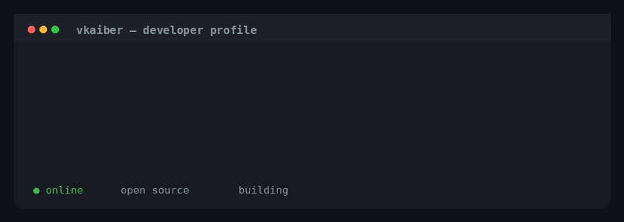

---

## ⚡ Currently Building

<p align="center">
  
</p>

<p align="center">
  <code>open source</code>
  <code>web development</code>
  <code>developer tools</code>
  <code>infrastructure</code>
</p>

---

## 🧠 What I'm Exploring

<table>
<tr>
<td align="center" width="25%">

### 🌐 Web

Modern web applications, responsive interfaces and scalable frontend architecture.

</td>
<td align="center" width="25%">

### ☁️ Cloud

Self-hosted infrastructure, deployment systems and developer platforms.

</td>
<td align="center" width="25%">

### ⚙️ Backend

APIs, authentication, databases and reliable server-side systems.

</td>
<td align="center" width="25%">

### 🧩 Open Source

Building useful projects and sharing them with the community.

</td>
</tr>
</table>

---

## 🔥 Development Focus

```text
┌─────────────────────────────────────────────────────────┐
│                                                         │
│   BUILD       →       TEST       →       IMPROVE       │
│                                                         │
│   Ideas               Experiments          Production   │
│                                                         │
└─────────────────────────────────────────────────────────┘
```

<p align="center">

🔭 Building useful projects   •  
⚡ Improving performance   •  
🧩 Exploring new technologies

</p>

---

## 💻 Developer Stack

<p align="center">
  
</p>

---

<p align="center">

<b>Always building. Always learning. 🚀</b>

</p>
