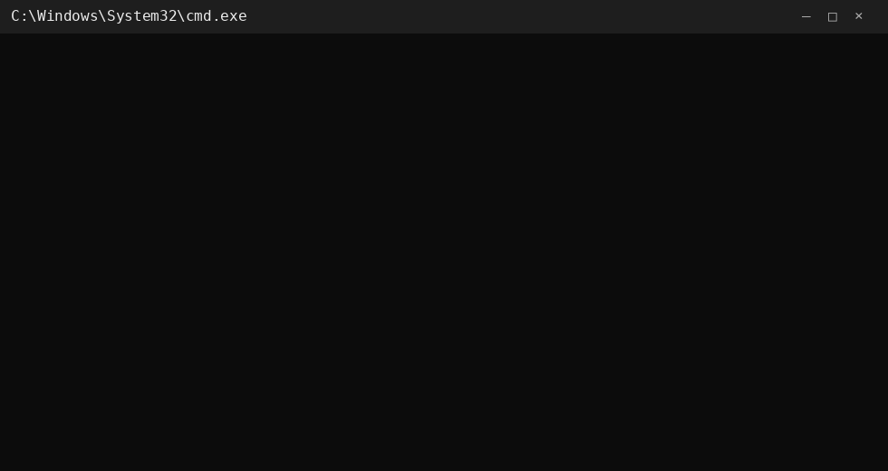

# 👋 Hi, I'm VKaiber

### Developer · Open Source · Web

I build modern web applications, developer tools, and open-source projects with a focus on clean design, useful functionality, and reliable software.

<p align="left">
  
  
  
</p>

---

## 🚀 Featured Projects

<table>
<tr>
<td width="50%">

### 🔗 LinkHub

A modern and customizable link-in-bio platform for creating personal pages, managing links, and customizing your online presence.

**Stack**

`React` `TypeScript` `Vite` `Node.js`

[View Repository →](https://github.com/vkaiber/linkhub)

</td>

<td width="50%">

### ☁️ Deploy Website

A self-hosted website deployment platform designed to simplify project management, deployments, and hosting workflows.

**Stack**

`Next.js` `TypeScript` `Node.js`

[View Repository →](https://github.com/vkaiber/deploy-website)

</td>
</tr>
</table>

---

## 🛠️ Tech Stack

### Languages

<p align="left">
  
</p>

### Frameworks & Runtime

<p align="left">
  
</p>

### Databases & Infrastructure

<p align="left">
  
</p>

### Tools

<p align="left">
  
</p>

---

## 💻 Development Environment

<p align="center">
  
</p>

<p align="center">
  <code>BUILD</code>
  <code>TEST</code>
  <code>DEPLOY</code>
  <code>REPEAT</code>
</p>

---

## 🧩 What I Work On

| Area              | Focus                                                   |
| ----------------- | ------------------------------------------------------- |
| 🌐 Web            | Modern web applications and responsive interfaces       |
| ⚙️ Backend        | APIs, authentication, databases and server-side systems |
| ☁️ Infrastructure | Self-hosted platforms and deployment systems            |
| 🧩 Open Source    | Useful tools, experiments and community projects        |

---

## 📌 Currently

* 🔭 Building open-source web tools
* 🌱 Exploring modern web technologies
* ⚡ Improving performance and developer experience
* 🧩 Experimenting with developer infrastructure
* 🚀 Turning ideas into usable projects
* 🤝 Open to interesting collaborations

---

## 🎯 Development Philosophy

```text
IDEA
  ↓
BUILD
  ↓
TEST
  ↓
IMPROVE
  ↓
DEPLOY
  ↓
REPEAT
```

> Build useful things. Keep improving them.

---

## 📫 Let's Connect

If you'd like to collaborate, discuss an idea, or work on an open-source project, feel free to open a discussion or issue on one of my repositories.

<p align="center">
  <a href="https://github.com/vkaiber">
    
  </a>
</p>

---

<p align="center">
  <b>Always building. Always learning. 🚀</b>
</p>
